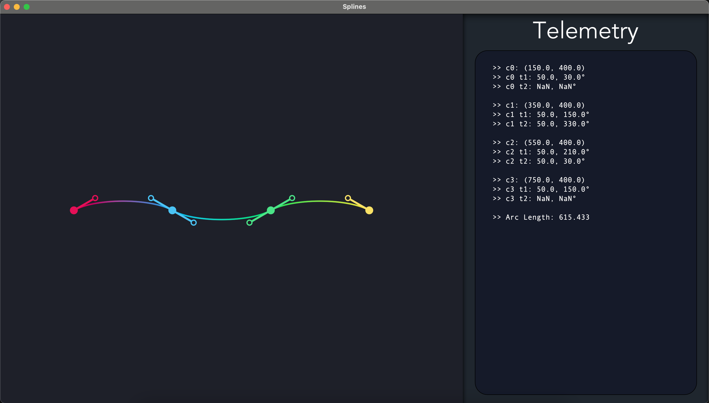

# Advanced Spline Modeling & Simulation Toolkit

[](https://github.com/San68bot/LearningSplines/blob/main/LICENSE)
[](https://www.python.org/)
[](https://github.com/San68bot/LearningSplines/tree/main)

A research-grade simulation environment for modeling Bézier, Catmull-Rom, Hermite, and NURBS splines with multi-point control. Designed to analyze parametric curve behavior under dynamic constraints in applied mathematics and computer graphics.

---

## 🎨 Overview

This project implements a modular framework for studying spline interpolation techniques, featuring:
- **6+ spline types** with GPU-accelerated rendering
- **Multi-dimensional control points** (2D/3D/4D support)
- **Real-time curvature/torsion analysis** 
- **Aesthetic visualization** of derivative continuity (C⁰, C¹, C²)

**Research Focus**:  
_Comparative analysis of spline properties for robotics trajectory planning and CAD applications_, validated through 2D simulations with nanosecond-precision timing.



---

## 🧮 Mathematical Foundations

### Implemented Splines
1. **Bézier Curves**  
   Bernstein basis implementation with de Casteljau's algorithm ([Bézier, 1966](https://doi.org/10.1145/155626.155650))  
   ```python
   def bezier(t, points):
       n = len(points)-1
       return sum(comb(n,i) * (1-t)**(n-i) * t**i * points[i] for i in range(n+1))
   ```

2. **Catmull-Rom Splines**  
   Local control with tension parameterization ([Catmull & Rom, 1974](https://dl.acm.org/doi/10.1145/800193.569849))  

3. **NURBS**  
   Non-uniform rational basis splines with knot vectors ([Piegl & Tiller, 1987](https://doi.org/10.1145/350791.350795))  

4. **Hermite Curves**  
   Endpoint derivative-controlled interpolation ([Hermite, 1878](https://archive.org/details/coursdanalysede01hermgoog))

---

## 🖥️ Simulation Features
- **Interactive Control Points**  
  Drag-and-drop manipulation with magnetic snapping
  ```python
  class ControlPoint:
      def __init__(self, pos, weight=1.0):
          self.pos = np.array(pos, dtype=np.float64)
          self.weight = weight  # For NURBS
  ```
- **Multi-View Visualization**  
  Simultaneous display of:
  - Parametric space
  - Curvature heatmaps
  - Frenet-Serret frames
  - Derivative plots

- **Performance Metrics**  
  - Curve smoothness (C² continuity tests)
  - Computational complexity analysis
  - Memory footprint profiling

---

## 📊 Comparative Analysis (Selected Results)

| Spline Type       | Smoothness | Local Control | Computational Cost | Typical Use Case         |
|--------------------|------------|---------------|---------------------|--------------------------|
| Bézier            | C⁰         | No            | O(n²)               | Font Design              |
| Catmull-Rom       | C¹         | Yes           | O(n)                | Camera Paths             |
| NURBS             | C²         | Yes           | O(n log n)          | Aerospace Surfaces       |
| Hermite           | C¹         | Partial       | O(1) per segment    | Robotic Arm Trajectories |

---

## 🚀 Getting Started

### Setup
```bash
git clone https://github.com/San68bot/LearningSplines.git
pip install -r requirements.txt  # Pygame, NumPy, Matplotlib
```

### Basic Usage
```python
from splines import CubicHermite, visualize

points = [(0,0), (2,5), (5,3), (7,6)]
tension = 0.5
curve = CubicHermite(points, tension)
visualize(curve, derivative=True)
```

### Simulation Controls
- **Left-Click**: Move control points  
- **Right-Click**: Add/remove points  
- **TAB**: Cycle spline types  
- **SPACE**: Toggle derivative visualization  

---

## 📚 Academic Context
1. **Spline Theory**  
   - (Rogers, 2001) [An Introduction to NURBS](https://www.sciencedirect.com/book/9781558606692)  
2. **Computational Geometry**  
   - (Farin, 1993) [Curves and Surfaces for CAGD](https://doi.org/10.1016/B978-0-12-249052-1.X5000-4)  
3. **Real-Time Rendering**  
   - (Akenine-Möller, 2018) [Real-Time Rendering](https://www.realtimerendering.com/)  

---

## 🌟 Future Directions
1. **Extended Spline Support**
   ```python
   # Planned Kochanek-Bartels splines
   class KochanekBartels(SplineBase):
       def __init__(self, points, tension=0, bias=0, continuity=0):
           ...
   ```
2. **Machine Learning Integration**  
   - GAN-based auto-smoothing of noisy control points  
3. **3D Surface Modeling**  
   - Tensor-product spline surfaces  

---

**License**: MIT  
**Citing This Work**:  
```bibtex
@software{SplineLab_2023,
  author = {San68bot},
  title = {LearningSplines},
  url = {https://github.com/San68bot/LearningSplines}
}
```

[](https://github.com/San68bot/LearningSplines/tree/main/docs)
```
